# Практика 1. Wireshark: HTTP
Эта работа исследует несколько аспектов протокола HTTP: базовое взаимодействие GET/ответ,
форматы сообщений HTTP, получение больших файлов HTML, получение файлов HTML со
встроенными объектами, а также проверку подлинности и безопасность HTTP.

Во всех заданиях (а также во всех следующих лабах) предполагается, что вы к своему ответу 
приложите **подтверждающий скрин** программы Wireshark (достаточно одного скрина на задание).

## Задание 1. Базовое взаимодействие HTTP GET/response (2 балла)

#### Подготовка
1. Запустите веб-браузер.
2. Запустите анализатор пакетов Wireshark, но пока не начинайте захват пакетов. Введите
   «http» в окне фильтра, чтобы позже в окне списка пакетов отображались только захваченные сообщения HTTP.
3. Подождите несколько секунд, а затем начните захват пакетов Wireshark.
4. Введите в браузере адрес: http://gaia.cs.umass.edu/wireshark-labs/HTTP-wireshark-file1.html.  
   Ваш браузер должен отобразить очень простой однострочный HTML-файл.
5. Остановите захват пакетов Wireshark.

#### Вопросы
1. Использует ли ваш браузер HTTP версии 1.0 или 1.1? Какая версия HTTP работает на
   сервере?
   - HTTP/1.1

   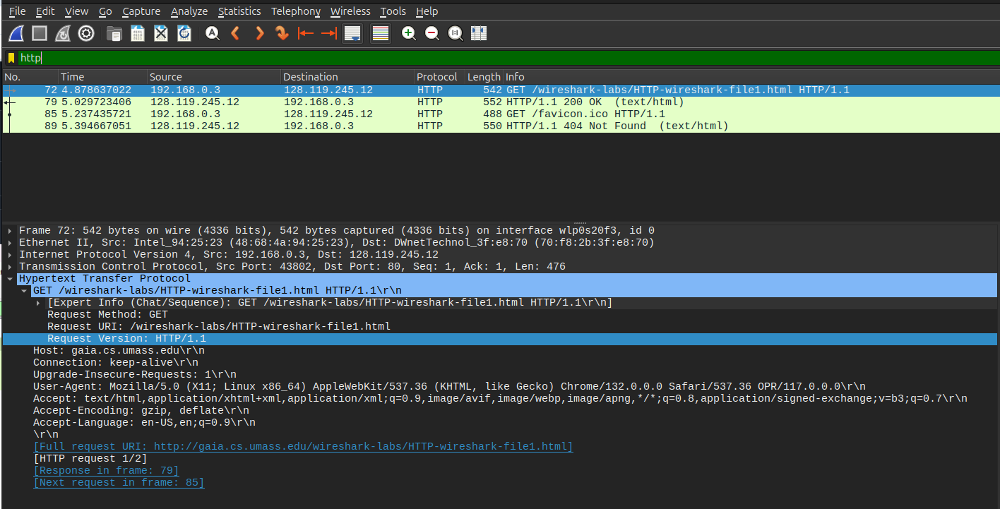
   - HTTP/1.1
   
   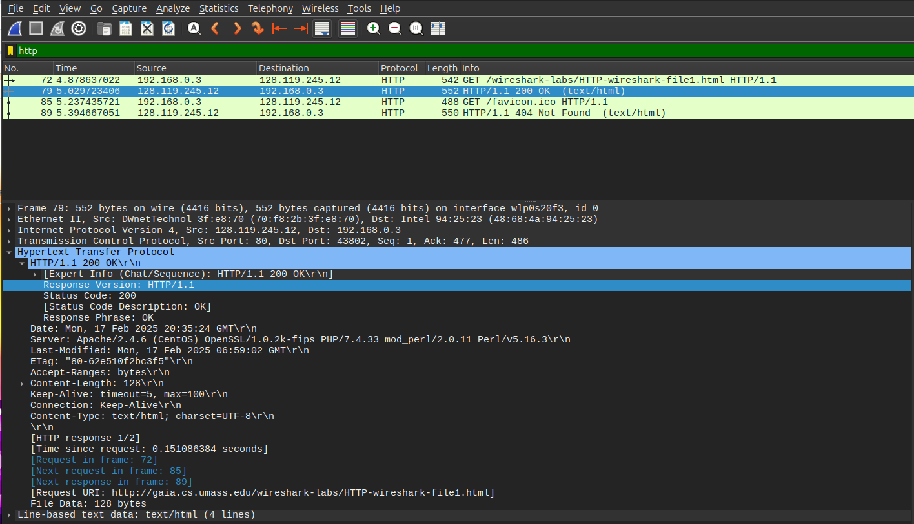
2. Какие языки (если есть) ваш браузер может принимать? В захваченном сеансе какую еще
   информацию (если есть) браузер предоставляет серверу относительно пользователя/браузера?
   - Английский (en-US, en)

   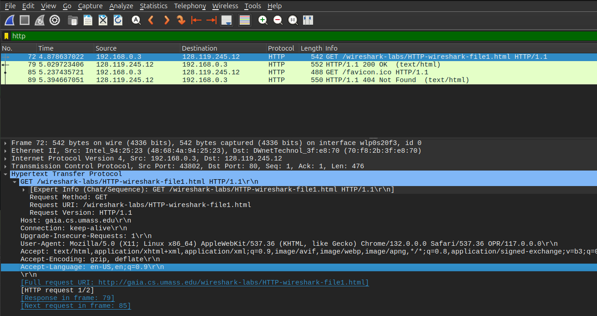
   - Версия браузера, операционная система и платформа (Linux, x86_64), версии WebKit (537.36), Opera (117). Accept-Encoding: gzip -- алгоритм сжатия для обработки запроса.

3. Какой IP-адрес вашего компьютера? Какой адрес сервера gaia.cs.umass.edu?
   - Мой адрес: 192.168.0.3
   - Адрес сервера: 128.119.245.12

   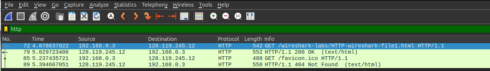
   

4. Какой код состояния возвращается с сервера на ваш браузер?
   - Status code: 200

   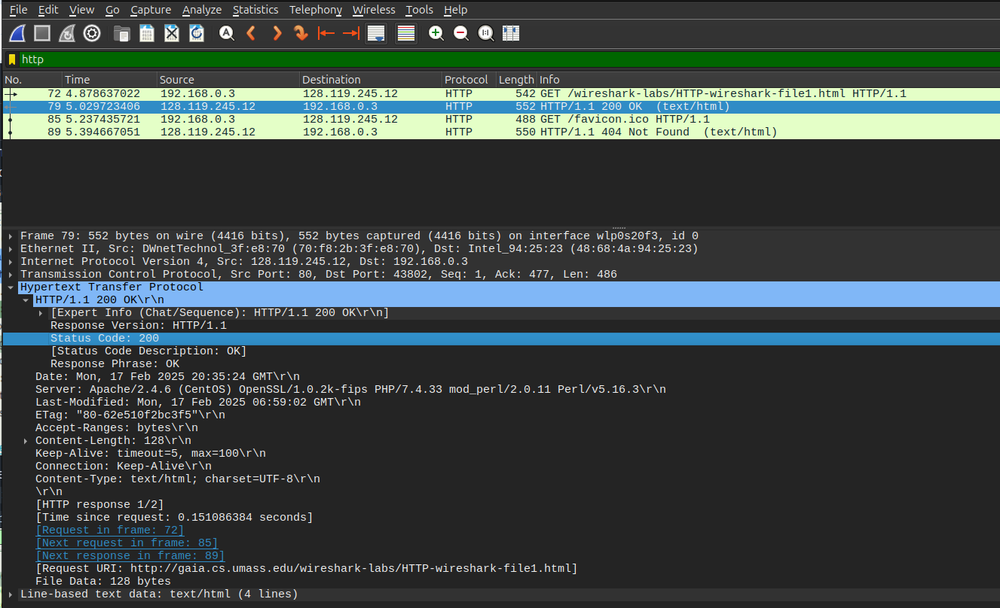
5. Когда HTML-файл, который вы извлекаете, последний раз модифицировался на сервере?
   - 17.02.2025 в 06:59:02 GMT

   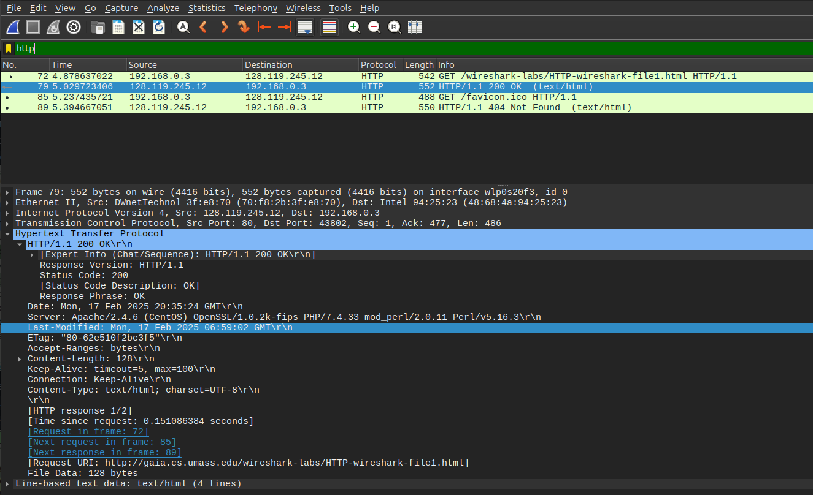
6. Сколько байтов контента возвращается вашему браузеру?
   - 128

   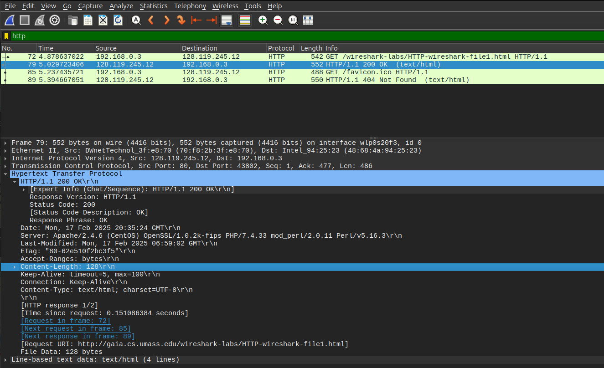

## Задание 2. HTTP CONDITIONAL GET/response (2 балла)
Большинство веб-браузеров выполняют кэширование объектов и, таким образом, выполняют
условный GET при извлечении объекта HTTP. Прежде чем выполнять описанные ниже шаги, 
убедитесь, что кеш вашего браузера пуст.

#### Подготовка
1. Запустите веб-браузер и убедитесь, что кэш браузера очищен.
2. Запустите анализатор пакетов Wireshark.
3. Введите следующий URL-адрес в адресную строку браузера:
   http://gaia.cs.umass.edu/wireshark-labs/HTTP-wireshark-file2.html.  
   Ваш браузер должен отобразить очень простой пятистрочный HTML-файл.
4. Введите тот же URL-адрес в браузер еще раз (или просто нажмите кнопку обновления в
   браузере).
5. Остановите захват пакетов Wireshark и введите «http» в окне фильтра, чтобы в окне списка
   пакетов отображались только захваченные HTTP-сообщения.

#### Вопросы
1. Проверьте содержимое первого HTTP-запроса GET. Видите ли вы строку «IF-MODIFIED-SINCE» в HTTP GET?
   - Нет

   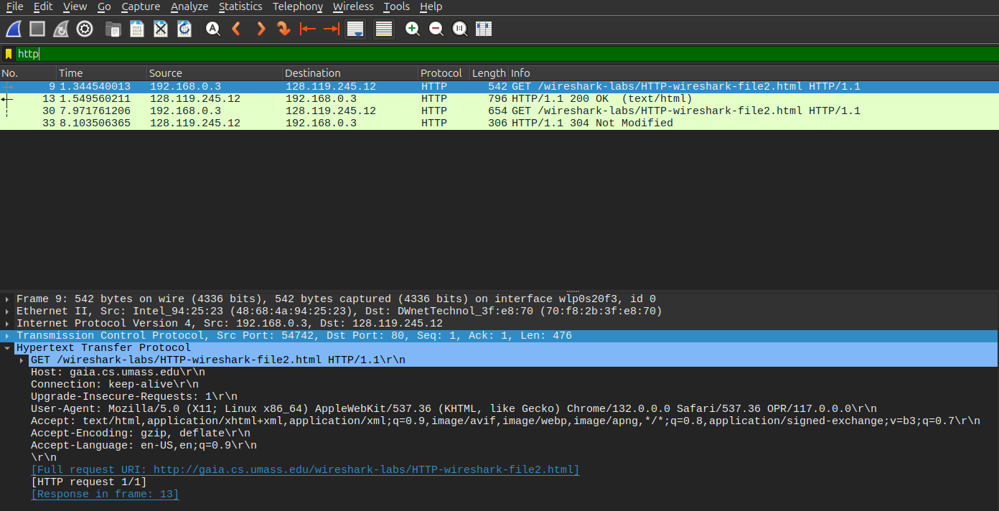

2. Проверьте содержимое ответа сервера. Вернул ли сервер содержимое файла явно? Как вы
   это можете увидеть?
   - Да, сервер отправил содержимое HTML файла явно.
   - Последние 371 байт (Content-Length) ответа -- содержимое файла.

   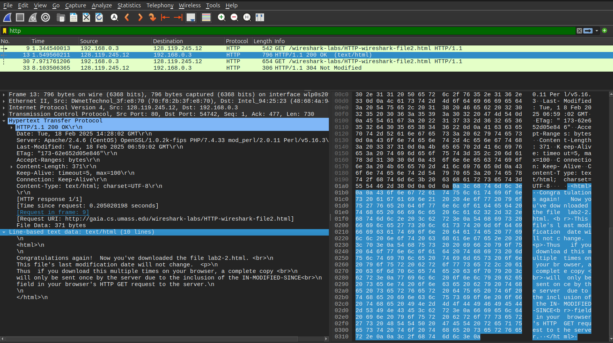
3. Теперь проверьте содержимое второго HTTP-запроса GET (из вашего браузера на сторону
   сервера). Видите ли вы строку «IF-MODIFIED-SINCE» в HTTP GET? Если да, то какая
   информация следует за заголовком «IF-MODIFIED-SINCE»?
   - Да, во втором GET запросе есть заголовок If-Modified-Since: Tue, 18 Feb 2025 06:59:02 GMT  (Даты в заданиях №1 и №2 отличаются, поскольку запросы выполнялись в разные дни, а файл на сервере обновляется ежедневно).

   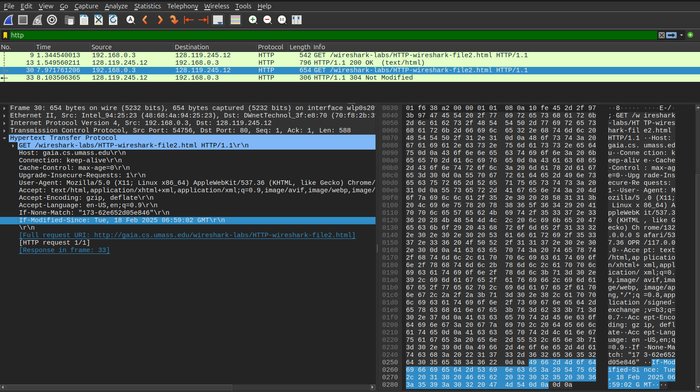
4. Какой код состояния HTTP и фраза возвращаются сервером в ответ на этот второй запрос
   HTTP GET? Вернул ли сервер явно содержимое файла?
   - Status Code: 304 (Not Modified)
   - Сервер не вернул содержимое файла

   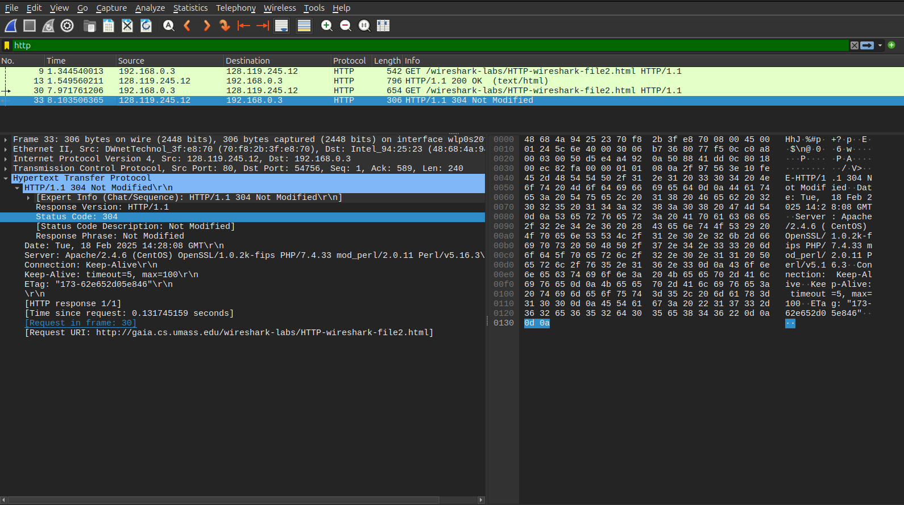

## Задание 3. Получение длинных документов (2 балла)

#### Подготовка
1. Запустите веб-браузер и убедитесь, что кэш браузера очищен.
2. Запустите анализатор пакетов Wireshark.
3. Введите следующий URL-адрес в адресную строку браузера:
   http://gaia.cs.umass.edu/wireshark-labs/HTTP-wireshark-file3.html  
   В браузере должен отобразиться довольно длинный текст.
4. Остановите захват пакетов Wireshark и введите «http» в окне фильтра.

#### Вопросы
1. Сколько сообщений HTTP GET отправил ваш браузер? Какой номер пакета в трассировке
   содержит сообщение GET?
   - Браузер отправил один HTTP GET запрос
   - Пакет №5

   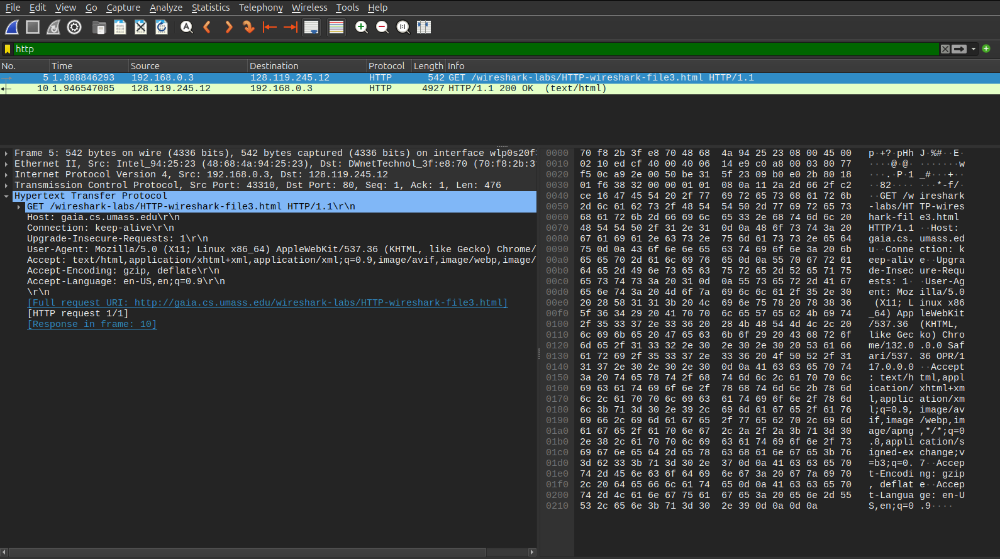

2. Какой номер пакета в трассировке содержит код состояния и фразу, связанные с ответом
   на HTTP-запрос GET?
   - Пакет №10

   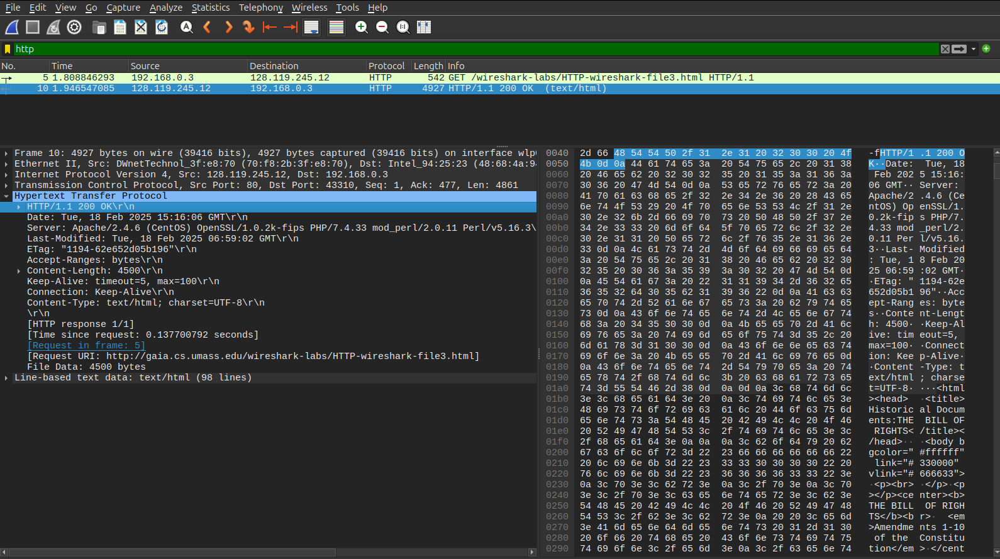

3. Сколько сегментов TCP, содержащих данные, потребовалось для передачи одного HTTP ответа?
   - Один сегмент размером 4861 байт

   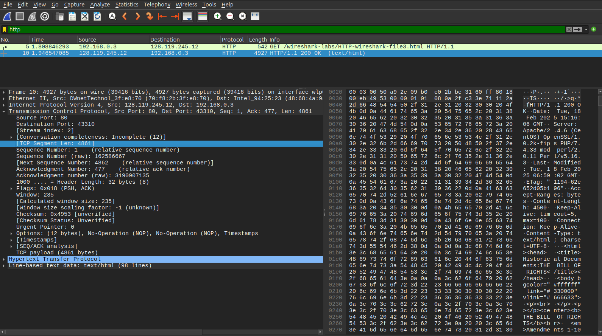
4. Есть ли в передаваемых данных какая-либо информация заголовка HTTP, связанная с
   сегментацией TCP?
   - Нет

## Задание 4. HTML-документы со встроенными объектами (2 балла)
Исследуйте, что происходит, когда ваш браузер загружает файл со встроенными объектами, т. е. файл, 
включающий в себя другие объекты (в данном примере это файлы и картинки),
которые хранятся на другом сервере (серверах).

#### Подготовка
1. Запустите веб-браузер и убедитесь, что кэш браузера очищен.
2. Запустите анализатор пакетов Wireshark.
3. Введите следующий URL-адрес в адресную строку браузера:
   http://gaia.cs.umass.edu/wireshark-labs/HTTP-wireshark-file4.html.  
   Ваш браузер должен отобразить HTML-файл с двумя изображениями. На эти два изображения есть ссылки в
   базовом файле HTML. То есть сами изображения не содержатся в HTML, вместо этого URL-
   адреса изображений содержатся в загруженном файле HTML. Ваш браузер должен
   получить эти изображения с указанных веб-сайтов.
4. Остановите захват пакетов Wireshark и введите «http» в окне фильтра.

#### Вопросы
1. Сколько HTTP GET запросов было отправлено вашим браузером? На какие интернет-адреса были отправлены эти GET-запросы?
   - Браузер выполнил 3 GET запроса
   - 1. http://gaia.cs.umass.edu/wireshark-labs/HTTP-wireshark-file4.html
     2. http://gaia.cs.umass.edu/pearson.png
     3. http://kurose.cslash.net/8E_cover_small.jpg

   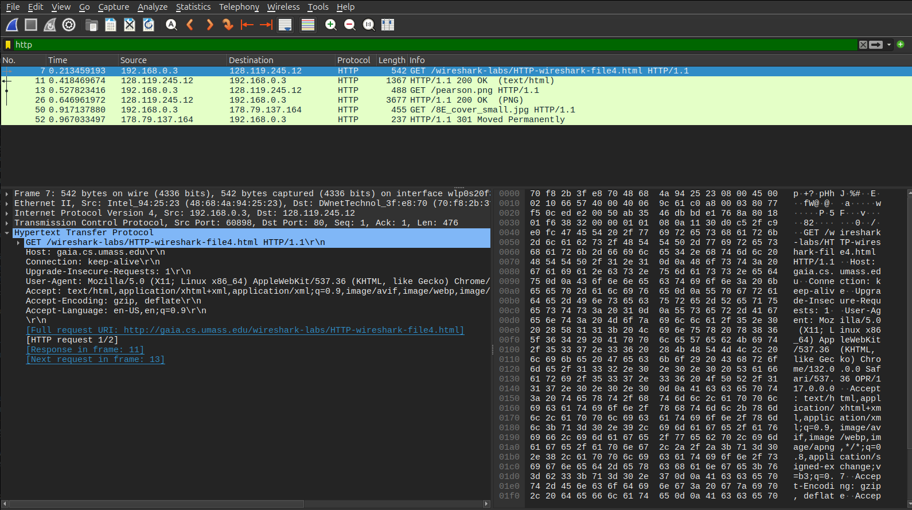  
2. Можете ли вы сказать, загрузил ли ваш браузер два изображения последовательно или
   они были загружены с веб-сайтов параллельно? Объясните.
   - Браузер отправил запросы на картинки последовательно, поскольку GET запрос для второй картинки отправлен после получения ответа на GET запрос для первой картинки.

   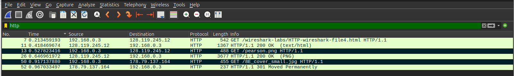

## Задание 5. HTTP-аутентификация (2 балла)
Запустите веб-сайт, защищенный паролем, и исследуйте последовательность HTTP-сообщений, которыми обмениваются такие сайты.

#### Подготовка
1. Убедитесь, что кеш вашего браузера очищен.
2. Запустите анализатор пакетов Wireshark.
3. Введите следующий URL-адрес в адресную строку браузера:
   http://gaia.cs.umass.edu/wireshark-labs/protected_pages/HTTP-wireshark-file5.html
4. Введите требуемые имя пользователя и пароль во всплывающем окне  
   (Имя пользователя — «wireshark-students», пароль — «network»).
5. Остановите захват пакетов Wireshark и введите «http» в окне фильтра

#### Вопросы
1. Каков ответ сервера (код состояния и фраза) в ответ на начальное HTTP-сообщение GET от вашего браузера?
   - 401 Unauthorized
2. Когда ваш браузер отправляет сообщение HTTP GET во второй раз, какое новое поле включается в сообщение HTTP GET?
   - Authorization, включающее в себя Credentials (логин и пароль)

   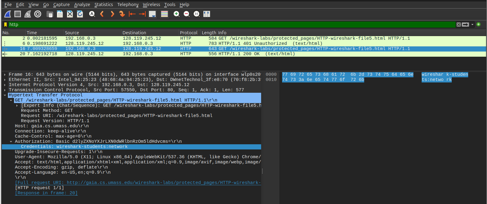
