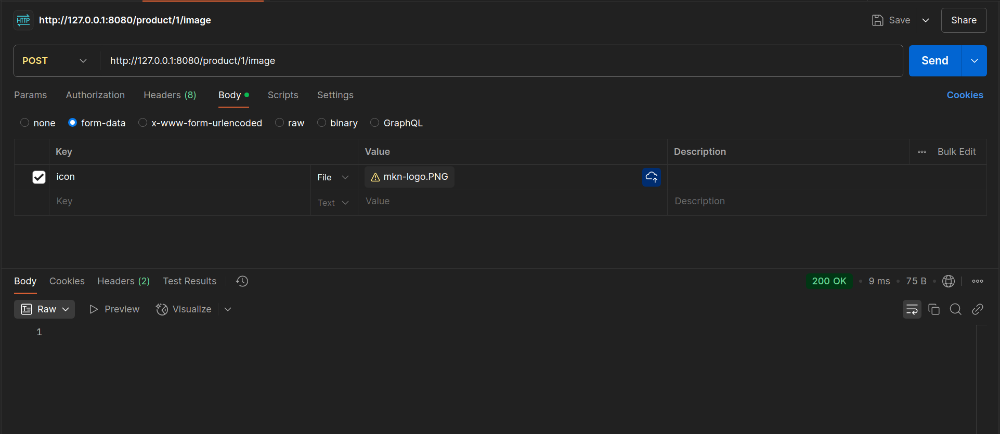

# Практика 2. Rest Service

## Программирование. Rest Service. Часть I

### Задание А (3 балла)
Создайте простой REST сервис, в котором используются HTTP операции GET, POST, PUT и DELETE.
Предположим, что это сервис для будущего интернет-магазина, который пока что умеет 
работать только со списком продуктов. У каждого продукта есть поля: `id` (уникальный идентификатор),
`name` и `description`. 

Таким образом, json-схема продукта (обозначим её `<product-json>`):

```json
{
  "id": 0,
  "name": "string",
  "description": "string"
}
```

Данные продукта от клиента к серверу должны слаться в теле запроса в виде json-а, **не** в параметрах запроса.

Ваш сервис должен поддерживать следующие операции:
1. Добавить новый продукт. При этом его `id` должен сгенерироваться автоматически
   - `POST /product`
   - Схема запроса:
     ```json
     {
       "name": "string",
       "description": "string"
     }
     ```
   - Схема ответа: `<product-json>` (созданный продукт)
2. Получить продукт по его id
   - `GET /product/{product_id}`
   - Схема ответа: `<product-json>`
3. Обновить существующий продукт (обновляются только те поля продукта, которые были переданы в теле запроса)
   - `PUT /product/{product_id}`
   - Схема запроса: `<product-json>` (некоторые поля могут быть опущены)
   - Схема ответа: `<product-json>` (обновлённый продукт)
4. Удалить продукт по его id
   - `DELETE /product/{product_id}`
   - Схема ответа: `<product-json>` (удалённый продукт)
5. Получить список всех продуктов 
   - `GET /products`  
   - Схема ответа:
     ```
     [ 
       <product-json-1>,
       <product-json-2>, 
       ... 
     ]
     ```

Предусмотрите возвращение ошибок (например, если запрашиваемого продукта не существует).

Вы можете положить код сервиса в отдельную директорию рядом с этим документом.

### Задание Б (3 балла)
Продемонстрируйте работоспособность сервиса с помощью программы Postman
(https://www.postman.com/downloads) и приложите соответствующие скрины, на которых указаны
запросы и ответы со стороны сервиса для **всех** его операций.

#### Демонстрация работы
## 1. `POST` /product


## 2. `GET` /product/{product_id}


## 3. `PUT` /product/{product_id}


## 4. `DELETE` /product/{product_id}


### Проверим, что продукта с ID = 1 больше нет.


## 5. `GET` /products
### Для начала добавим два продукта


### Теперь запросим весь список

### Напоследок удалим ненужный апельсин

### Проверим, что книга осталась на месте


### Задание В (4 балла)
Пусть ваш продукт также имеет иконку (небольшую картинку). Формат иконки (картинки) может
быть любым на ваш выбор. Для простоты будем считать, что у каждого продукта картинка одна.

Добавьте две новые операции:
1. Загрузить иконку:
   - `POST product/{product_id}/image`
   - Запрос содержит бинарный файл — изображение  
     
2. Получить иконку:
   - `GET product/{product_id}/image`
   - В ответе передаётся только сама иконка  
     

Измените операции в Задании А так, чтобы теперь схема продукта содержала сведения о загруженной иконке, например, имя файла или путь:
```json
"icon": "string"
```

#### Демонстрация работы
## 1. Добавим продукт

## 2. Добавим продукту картинку

## 3. Проверим, что продукт хранит информацию о картинке

## 4. Запросим картинку у сервера


---

_(*) В последующих домашних заданиях вам будет предложено расширить функционал данного сервиса._

## Задачи

### Задача 1 (2 балла)
Общая (сквозная) задержка прохождения для одного пакета от источника к приемнику по пути,
состоящему из $N$ соединений, имеющих каждый скорость $R$ (то есть между источником и
приемником $N - 1$ маршрутизатор), равна $d_{\text{сквозная}} = N \dfrac{L}{R}$
Обобщите данную формулу для случая пересылки количества пакетов, равного $P$.

#### Решение
Рассмотрим случай $P = 2$. Сначала отправится первый пакет, как только он дойдет до следующего устройства (первого маршрутизатора на пути), отправится второй пакет. Таким образом, когда первый пакет дойдет до приемника, второй пакет дойдет до последнего маршрутизатора и ему останется добраться до приемника (по соединению между последним маршрутизатором и приемником), что займет $\frac{L}{R}$ секунд. Итого $d_2 = d_1 + \frac{L}{R} = \frac{(N+1)L}{R}$, где $d_i$ -- это сквозная задержка для $i$ пакетов.

Пусть для $P = K$ формула верна, покажем, что для $P = K + 1$ тоже верна. Когда $K$-ый пакет достигент приемника, $(K+1)$-ый пакет дойдет до последнего маршрутизатора и ему остнется пройти по последнему соединению, что займет $\frac{L}{R}$ секунд, итого $d_{K+1} = d_K + \frac{L}{R} = \frac{(N + K - 1) \cdot L}{R} + \frac{L}{R} = \frac{(N + K) \ cdot L}{R}$.

Так, для всякого $P$ формула общей задержки: $$d_P = \frac{(N + P - 1)\cdot L}{R}$$

### Задача 2 (2 балла)
Допустим, мы хотим коммутацией пакетов отправить файл с хоста A на хост Б. Между хостами установлены три
последовательных канала соединения со следующими скоростями передачи данных:
$R_1 = 200$ Кбит/с, $R_2 = 3$ Мбит/с и $R_3 = 2$ Мбит/с.
Сколько времени приблизительно займет передача на хост Б файла размером $5$ мегабайт?
Как это время зависит от размера пакета?

#### Решение
Пакет размера 5 мегабайт(Мб). Время в пути = (5 Мб / 200 Кбит/c) + (5 Мб / 3 Мбит/с) + (5 Мб / 2 Мбит/c) $\approx$ 209с + 14с + 26с = **259 секунд**.

Пакет размера 1 мегабайт(Мб). Время в пути = (1 Мб / 200 Кбит/c) + (1 Мб / 3 Мбит/с) + (1 Мб / 2 Мбит/c) $\approx$ 42с + 3с + 4с = 49 секунд. Нам нужно отправить 5 таких пакетов. Общее время в пути составит 4 * 42с + 42с + 3с + 4с = **217 секунд** 

Пояснение: для первых четырех пакетов мы учитываем только время передачи по самому медленному соединению, когда следующий пакет ждет своей очереди на отправку на хосте (остаток пути первые четыре пакета успевают дойти, пока следующий за ними пакет проходит по медленному соединению). Для последнего пакета мы учитываем весь путь. 

Пакет размера 5 килобайт(Кб). Время в пути = (5 Кб / 200 Кбит/c) + (5 Кб / 3 Мбит/с) + (5 Кб / 2 Мбит/c) $\approx$ 0.2с + 0.01c + 0.02с = 0.23 секунд. Нам нужно отправить 1024 таких пакетов. Общее время в пути составит 1023 * 0.2с + 0.2с + 0.01с + 0.02с = **204.83 секунд**

Для пакетов размером 1 Кб общее время доставки составит $\approx$ 204.8 секунд. 

Как мы видим, при разбиении большого файла на пакеты общее время доставки уменьшается. Однако мы не можем сделать размер пакета совсем маленьким, потому что мы упремся в задержки самих устройств (количество пакет будет настолько большим, что основное время транспортировки будет складываться не из передачи сигналов, а из обработки пакетов устройствами).


### Задача 3 (2 балла)
Предположим, что пользователи делят канал с пропускной способностью $2$ Мбит/с. Каждому
пользователю для передачи данных необходима скорость $100$ Кбит/с, но передает он данные
только в течение $20$ процентов времени использования канала. Предположим, что в сети всего $60$
пользователей. А также предполагается, что используется сеть с коммутацией пакетов. Найдите
вероятность одновременной передачи данных $12$ или более пользователями.

#### Решение
$$P(одновременно \ge 12) = 1 - P(одновременно < 12)$$
Получается схема Бернулли: p = 0.2, k = 1, ..., 11.

```python
prob = 0
for i in range(0, 12):
    prob += math.comb(60, i) * ((0.2) ** i) * ((0.8) ** (60 - i))
# 0.4486174737493493    
```
Ответ: $\approx$ 1 - 0.448 = **0.552**.


### Задача 4 (2 балла)
Пусть файл размером $X$ бит отправляется с хоста А на хост Б, между которыми три линии связи и
два коммутатора. Хост А разбивает файл на сегменты по $S$ бит каждый и добавляет к ним
заголовки размером $80$ бит, формируя тем самым пакеты длиной $L = 80 + S$ бит. Скорость
передачи данных по каждой линии составляет $R$ бит/с. Загрузка линий мала, и очередей пакетов
нет. При каком значении $S$ задержка передачи файла между хостами А и Б будет минимальной?
Задержкой распространения сигнала пренебречь.

#### Решение
Воспользуемся формулой из задачи 1. Есть $P = X / S$ пакетов, тогда общая задержка $d = \frac{(N + P - 1) \cdot L}{R}$, где $N$ = 3, получаем следующую формулу: $$ d = \frac{(P + 2) \cdot L}{R} = \frac{(P + 2) \cdot (80 + S)}{R} $$

Количество пакетов $P = \frac{X}{S}$, тогда $$d = \frac{(\frac{X}{S} + 2) \cdot (80 + S)}{R}$$. Чтобы найти минимум, найдем производную по $S$: $$\left( \frac{(\frac{X}{S} + 2) \cdot (80 + S)}{R} \right)_S' = ... = \left( \frac{2S}{R} + \frac{80X}{RS} \right)_S' = \frac{2}{R} - \frac{80X}{R\sqrt{S}}$$. Приравняем производную к нулю, найдем значение $S$: $$ \sqrt{S} = 40X, S = \sqrt{40X} = 2\sqrt{10X} $$
Получили, что при $S = 2\sqrt{10X}$ достигается минимальная задержка.

### Задание 5 (2 балла)
Рассмотрим задержку ожидания в буфере маршрутизатора. Обозначим через $I$ интенсивность
трафика, то есть $I = \dfrac{L a}{R}$.
Предположим, что для $I < 1$ задержка ожидания вычисляется как $\dfrac{I \cdot L}{R (1 – I)}$. 
1. Напишите формулу для общей задержки, то есть суммы задержек ожидания и передачи.
2. Опишите зависимость величины общей задержки от значения $\dfrac{L}{R}$.

#### Решение
todo
